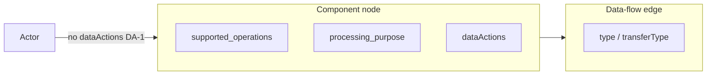

# Data Actions vs Adjacent Lanes

Canonical types live in **`src/core/types/data-action.ts`**. The verb vocabulary lives in **`src/data-actions/taxonomy.ts`**. Product rulings: Overview Privacy Intelligence decision log (**DA-1**…**DA-5**) and `PRD_Data_Action_Classification.md` §4.2.

## Set-valued model

A node carries **many** privacy verbs, not one:

- `properties.dataActions: DataActionAssignment[]` — each entry has its own `action`, `evidence`, `confidence`, `source`, and optional `status`.
- `properties.primaryDataAction` — **display only** (canvas badge / default chip). Never replace or collapse the array (DA-5).

Eval and exports check that expected **asserted** verbs are **present** among assignments. They do not require exactly one verb per node.

## Four lanes (DA-3)

These fields are adjacent and **permanently separate in v1**. Do not merge them, derive one from another, or treat `transform` in `supported_operations` as the privacy verb `transform`.

| Field | Lane | Example values | Where it lives |
|---|---|---|---|
| Flow transport type | **How bytes move** | `api_call`, `webhook`, `message_queue` | `DetectedDataFlow.type`; diagram `engineering.transferType` |
| `supported_operations` | **CRUD mechanics** | `read`, `write`, `query`, `transform` | `DetectedComponent.properties.supported_operations` |
| `processing_purpose` | **Why** (business purpose) | `payment_processing`, `analytics` | component `processing_purpose` / flow `processingPurpose` |
| **`dataActions`** | **What happens to the data** (privacy semantics) | `collect`, `store`, `relay`, `log` | `DetectedComponent.properties.dataActions` |

Edge `DetectedDataFlow.actions` is **not** this field. Privacy verbs are **node** `dataActions` only.

## Actors (DA-1)

`dataActions` applies to **`asset`** and **`third_party`** only. Actor nodes never receive `dataActions` in scan output, diagram export, or app persistence. Use `componentMayCarryDataActions(type)` as the contract guard.

## Candidates vs asserted

- `status: "asserted"` (or omitted) — facts for export, readiness, and rule triggers; gold-positive eval labels.
- `status: "candidate"` — interview handoff only (e.g. topology-only `relay`). Never a gold positive label; never rendered as a fact.

Topology-only `relay` stays `candidate` until corroboration is recorded on `TopologyEvidence.corroboration` (conservative-absence rule).

## Canonical verbs

Eleven verbs; aliases normalize into that set. See `src/data-actions/taxonomy.ts` and PRD §4.1. The canonical set does not grow past ~a dozen without a framework anchor.
