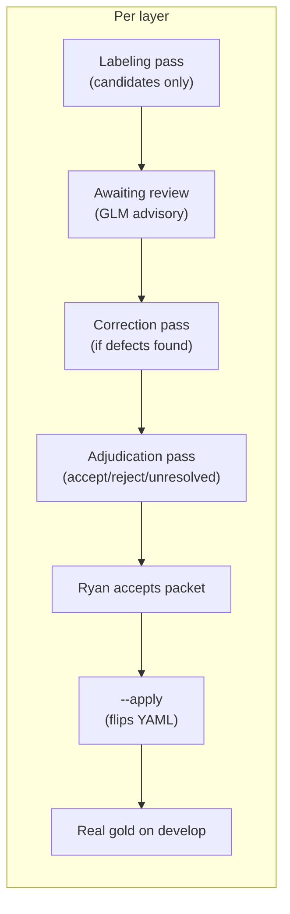

# Corpus Gold Status

Row-level observability for the corpus gold migration (KDATAP-b0d5e2). Updated after each adjudication pass.

## Current totals

| Layer | Total rows | Accepted | Rejected | Unresolved | Status |
| --- | ---: | ---: | ---: | ---: | --- |
| **Data items** | 436 | 113 | 76 | 247 | **Adjudicated** (PR #50) - each label tracked as a finding issue |
| **Data flows** | 436 | 146 | 17 | 273 | **Adjudicated + applied** (PR #52) - each label tracked as a finding issue |
| Components | 481 | 481 | 0 | 0 | Accepted (prior passes) |
| Mentions | 357 | 357 | 0 | 0 | Accepted (prior passes) |
| **Corpus total** | **1710** | **1097** | **93** | **520** | |

## Per-label finding tracking

Each data-item label has its own Kanbus finding issue tracking its individual approval/rejection/review status:

| Finding status | Count | Meaning |
| --- | ---: | --- |
| `verified` | 113 | Accepted as gold truth |
| `closed` | 76 | Rejected - not a label |
| `proposed` | 247 | In consideration (unresolved) |

Use `kbs list --type finding` to see every label's status. Flow findings created after flow adjudication landed.

## Data flows (436 rows)

| Pass | Card | Status | Accept | Reject | Unresolved | What |
| --- | --- | --- | ---: | ---: | ---: | --- |
| Labeling | 8e7756 | closed | 0 | 0 | 436 | Mechanical: all needs_adjudication, candidates on 436 |
| Correction | a49e94 | closed | 0 | 0 | 436 | Fix saleor graph_edge + wordpress negative attribution |
| Adjudication | 47e331 | closed | 146 | 17 | 273 | AI adjudicated all 436 rows; GLM tightened 52 over-accepts, promoted 77 missed positives |
| **Current** | | | **146** | **17** | **273** | **Real gold on develop** (PR #52 applied) |

### Flow adjudication breakdown (47e331)

| Source bucket | Accept | Reject | Unresolved |
| --- | ---: | ---: | ---: |
| entity_picker_resolved | 72 | 0 | 0 |
| graph_edge (ORM demoted) | 1 | 0 | 0 |
| intra_overlap_same_entity | 25 | 0 | 14 |
| intra_single_component | 48 | 0 | 16 |
| rejection | 0 | 17 | 0 |
| intra_low_rationale_only | 0 | 0 | 85 |
| unresolved | 0 | 0 | 158 |
| **Total** | **146** | **17** | **273** |

Contested accepts: 121 (spot-check queue in pass.md).
GLM over-accepts demoted: 52 (static declarations accepted as flows).
GLM missed positives promoted: 77 (real runtime flows left unresolved).

## Data items (436 rows)

| Pass | Card | Status | Accept | Reject | Unresolved | What |
| --- | --- | --- | ---: | ---: | ---: | --- |
| Labeling | a0e80b | closed | 81 | 0 | 355 | Mechanical: candidates on 117, demote 275 source-token |
| Correction | 9b83f6 | closed | 76 | 0 | 360 | Fix 5 suffix-vs-label conflicts (email/password hashes) |
| Adjudication | 25b2f4 | closed | 113 | 76 | 247 | AI adjudicated all 436 rows from source + taxonomy |
| **Current** | | | **113** | **76** | **247** | Real gold on develop |

### Data-item adjudication breakdown (25b2f4)

| Source bucket | Accept | Reject | Unresolved |
| --- | ---: | ---: | ---: |
| Tier A - suffix maps | 76 | 0 | 0 |
| Tier B - label-guided | 37 | 0 | 0 |
| Tier C - category/unmapped | 0 | 0 | 146 |
| Tier E - never auto-map | 0 | 0 | 43 |
| Negative | 1 | 75 | 6 |
| Ambiguous | 0 | 0 | 52 |
| **Total** | **113** | **75+1** | **247** |

Label corrections: 49 (category to specific leaf, source-confirmed).
Contested calls: 38 (all in spot-check queue).
Over-accepts caught by GLM: 1 (`exposed-schema-password-not-data-item`, flipped to reject).

## Data flows (436 rows)

| Pass | Card | Status | Accept | Reject | Unresolved | What |
| --- | --- | --- | ---: | ---: | ---: | --- |
| Labeling | 8e7756 | closed | 0 | 0 | 436 | Mechanical: all needs_adjudication, candidates on 436 |
| Correction | a49e94 | closed | 0 | 0 | 436 | Fix saleor graph_edge + wordpress negative attribution |
| Adjudication | 47e331 | labeling | ? | ? | ? | AI adjudication in flight |
| **Current** | | | **0** | **0** | **436** | Pending adjudication |

## Process

- **Labels** describe the source; they are expected to expose scanner defects.
- **AI adjudicates** rows from pinned source + taxonomy (no scanner output).
- **Humans accept the packet** by sampling the spot-check queue, not row-by-row.
- **`--apply`** mechanically flips YAML and bumps the digest.
- **Unresolved** rows stay `needs_adjudication` and are excluded from headline metrics.

## What's next

1. **Baseline readiness gate** (KDATAP-b87baf) — **PASSED** (0 blockers). Code on develop (PRs #53-#55). Gate green with materialized repos.
2. **Baseline series 1 frozen** (KDATAP-3b935c) — artifact on develop (PR #57). Fingerprint `sha256:e0d0baec...`. First citable four-layer baseline.
3. **Compat loader removed** (KDATAP-f009ab) — PR #56. Direct canonical loader in place.
4. **Plexus SubjectIdentityScore integration** — DONE (PR #58). Direct Python invocation, no GraphQL server. 13 @layer-eval scenarios pass. 49 total features pass, 5 pending (canonical IR, separate).
5. **Scanner alignment** — future epic, not started. The 520 unresolved labels can be adjudicated later (LLM pass or human) without blocking the baseline.
