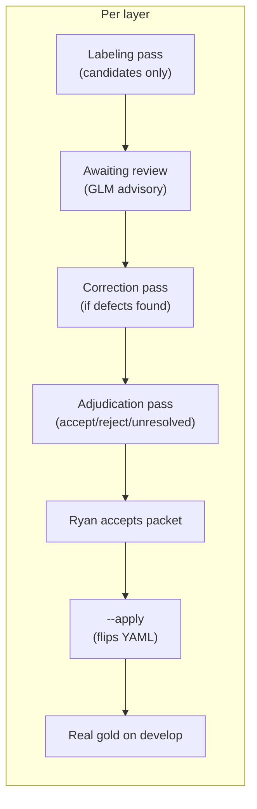

# Corpus Gold Status

Row-level observability for the corpus gold migration (KDATAP-b0d5e2). Finding counts in the live tables are queried from the board at render time.

## Current totals (YAML gold)

| Layer | Total rows | Accepted | Rejected | Unresolved | Status |
| --- | ---: | ---: | ---: | ---: | --- |
| **Data items** | 436 | 140 | 119 | 177 | Adjudicated and applied (PR #50, slice KDATAP-6b1c67) |
| **Data flows** | 436 | 146 | 17 | 273 | Adjudicated and applied (PR #52); canonical blocks (PR #54) |
| Components | 481 | 481 | 0 | 0 | Accepted (prior passes; not tracked as per-label findings) |
| Mentions | 357 | 357 | 0 | 0 | Accepted (prior passes; not tracked as per-label findings) |
| **Corpus total** | **1710** | **1124** | **136** | **450** | |

Each data-item and data-flow row has one finding issue under KDATAP-b0d5e2. Mapping onto the custom board: YAML `accepted` -> finding `accepted`, `rejected` -> finding `rejected`, `needs_adjudication` -> finding `proposed`. Sample-app Jest findings are in Done.

## Live finding board

These counts are what the custom board columns show.

| Board column | Live count | Expected | Meaning |
| --- | ---: | --- | --- |
| Proposed | {{ count(type="finding", status="proposed") }} | 450 | Unresolved corpus labels |
| Accepted | {{ count(status="accepted") }} | 286 | Human-accepted gold labels |
| Rejected | {{ count(type="finding", status="rejected") }} | 136 | Human-rejected labels |
| **Total findings** | **{{ count(type="finding") }}** | **888** | Drift if this is not 888 |

Layer split for the 872 corpus findings:

| Layer | Accepted | Rejected | Proposed | Total |
| --- | ---: | ---: | ---: | ---: |
| Data items (`Data item:`) | 140 | 119 | 177 | 436 |
| Data flows (`Data flow:`) | 146 | 17 | 273 | 436 |

Use `kbs list --type finding --parent b0d5e2`. Issue title is `Data item: <yaml id>` or `Data flow: <yaml id>`.

## Data flows (436 rows)

| Pass | Card | Status | Accept | Reject | Unresolved | What |
| --- | --- | ---: | ---: | ---: | ---: | --- |
| Labeling | 8e7756 | closed | 0 | 0 | 436 | Mechanical: all needs_adjudication, candidates on 436 |
| Correction | a49e94 | closed | 0 | 0 | 436 | Fix saleor graph_edge + wordpress negative attribution |
| Adjudication | 47e331 | closed | 146 | 17 | 273 | AI adjudicated all 436 rows; GLM tightened 52 over-accepts, promoted 77 missed positives |
| Canonical | 7e5b94 | closed | 146 | 17 | 273 | Wrote `flow_canonical` blocks so accepted rows score |
| **Current** | | | **146** | **17** | **273** | Real gold on develop |

### Flow adjudication breakdown (47e331)

| Source bucket | Accept | Reject | Unresolved |
| --- | ---: | ---: | ---: |
| entity_picker_resolved | 72 | 0 | 0 |
| graph_edge (ORM demoted) | 1 | 0 | 0 |
| intra_overlap_same_entity | 25 | 0 | 14 |
| intra_single_component | 48 | 0 | 16 |
| rejection | 0 | 17 | 0 |
| intra_low_rationale_only | 0 | 0 | 85 |
| unresolved | 0 | 0 | 158 |
| **Total** | **146** | **17** | **273** |

Contested accepts: 121 (spot-check queue in pass.md).
GLM over-accepts demoted: 52 (static declarations accepted as flows).
GLM missed positives promoted: 77 (real runtime flows left unresolved).

## Data items (436 rows)

| Pass | Card | Status | Accept | Reject | Unresolved | What |
| --- | --- | ---: | ---: | ---: | ---: | --- |
| Labeling | a0e80b | closed | 81 | 0 | 355 | Mechanical: candidates on 117, demote 275 source-token |
| Correction | 9b83f6 | closed | 76 | 0 | 360 | Fix 5 suffix-vs-label conflicts (email/password hashes) |
| Adjudication | 25b2f4 | closed | 113 | 76 | 247 | AI adjudicated all 436 rows from source + taxonomy |
| Adjudication slice 2 | 6b1c67 | closed | 27 | 43 | 177 | Remaining 247 rows; Ryan accepted packet |
| **Current** | | | **140** | **119** | **177** | Real gold on develop |

### Data-item adjudication breakdown (25b2f4)

| Source bucket | Accept | Reject | Unresolved |
| --- | ---: | ---: | ---: |
| Tier A - suffix maps | 76 | 0 | 0 |
| Tier B - label-guided | 37 | 0 | 0 |
| Tier C - category/unmapped | 0 | 0 | 146 |
| Tier E - never auto-map | 0 | 0 | 43 |
| Negative | 1 | 75 | 6 |
| Ambiguous | 0 | 0 | 52 |
| **Total** | **113** | **75+1** | **247** |

Label corrections: 49 (category to specific leaf, source-confirmed).
Contested calls: 38 (all in spot-check queue).
Over-accepts caught by GLM: 1 (`exposed-schema-password-not-data-item`, flipped to reject).

## Process

- Labels describe the source; they are expected to expose scanner defects.
- AI adjudicates rows from pinned source + taxonomy (no scanner output).
- Humans accept the packet by sampling the spot-check queue, not row-by-row.
- `--apply` mechanically flips YAML and bumps the digest.
- Unresolved rows stay `needs_adjudication` / finding `proposed` and are excluded from headline metrics.

## What's next

1. **KDATAP-b7c3ae** - enable data-flows metric for within-component flows (PR #59). Re-freeze baseline so all four layers report.
2. **Scanner alignment** - future work against the frozen baseline. Do not rewrite gold to match the scanner.
3. The 450 unresolved labels can be adjudicated later without blocking the baseline.
