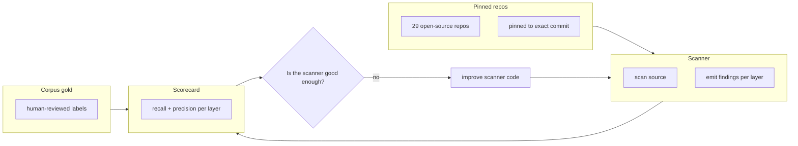
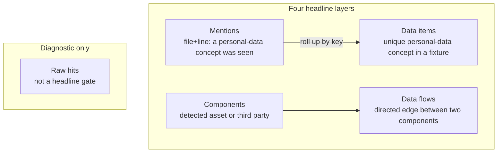
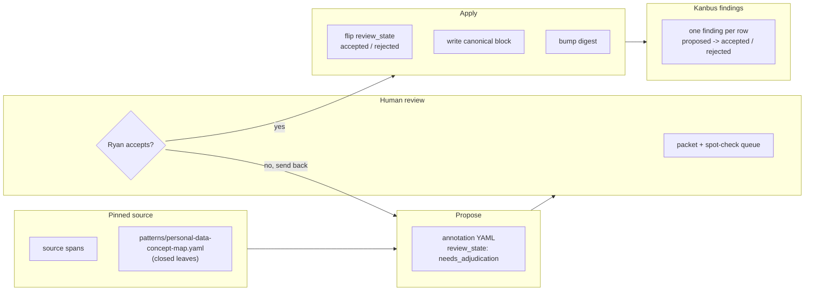
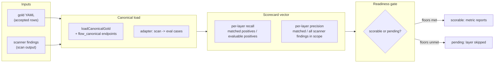
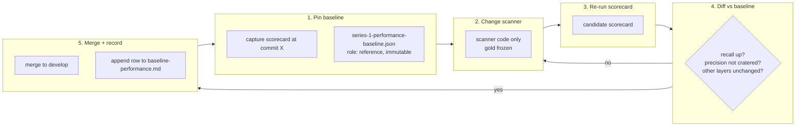
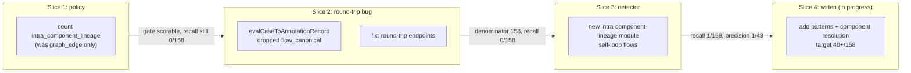
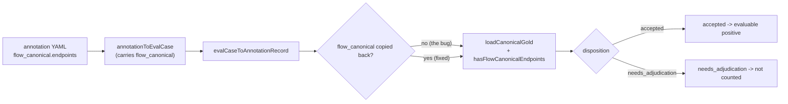
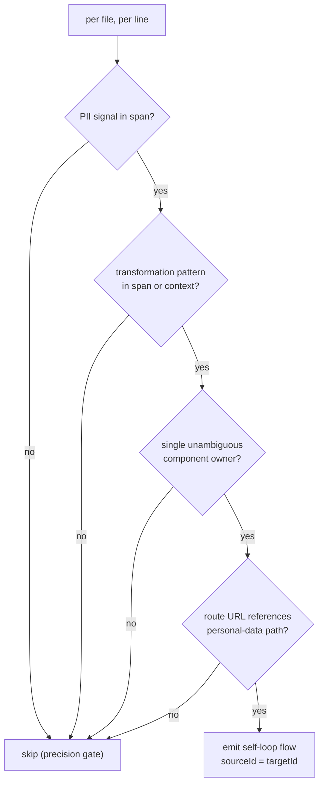
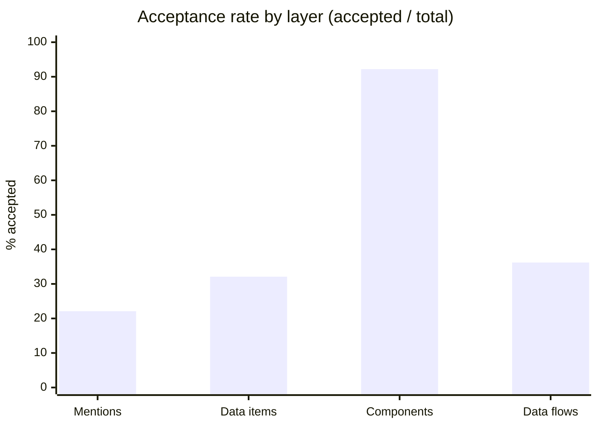

# Scanner evaluation — explained as slides

A slide deck for explaining how the four-layer scanner evaluation system works. Each slide is a Mermaid diagram plus a short explanation. Scroll through, or copy each block into a renderer (GitHub, Notion, Mermaid Live Editor).

---

## Slide 1 — The big picture

What we are building: a scanner that finds personal data in source code, measured against human-reviewed gold.

The scanner reads pinned source code and emits findings at four layers. We compare those findings to human-reviewed gold labels and compute recall and precision per layer. Low metrics expose scanner defects — which we then fix — without touching the gold.

---

## Slide 2 — The four layers

The scanner is scored at four independent headline layers. There is no cross-layer scalar; each layer is scored on its own.

| Layer | Identity key | What it measures |
|---|---|---|
| Mentions | `mention:<key>` | A personal-data concept was seen at a file+line |
| Data items | `data_item:<key>` | Unique personal-data concept in a fixture (rolled up across lines) |
| Components | `<type>:<name>` | Detected asset or third party from the scan pipeline |
| Data flows | `flow:<source>-><target>` | Directed edge between two components |

Raw hits are diagnostic only — scanned and reported, but they do not participate in headline gates.

---

## Slide 3 — Corpus gold curation

How the labels get created. Gold comes from pinned source plus a closed concept map — never from the scanner.

Every annotation row starts `needs_adjudication` (finding `proposed`). An AI adjudicates from source + concept map and produces a packet. A human accepts the packet. Only then does `--apply` flip the YAML and sync the board. Unresolved rows stay `proposed` — they are not weak labels, they are honest uncertainty.

---

## Slide 4 — The evaluation pipeline

How a scorecard is produced from gold + scanner output.

Each layer is scored independently. Recall = matched positive gold / all evaluable positives. Precision = matched valid findings / all scanner findings inside exhaustively annotated scopes. A layer reports only when its readiness floors are met; otherwise it is `pending` and skipped.

---

## Slide 5 — The baseline + improvement loop

How we measure improvement without fooling ourselves.

The baseline is pinned once and never overwritten. Each improvement slice re-runs the scorecard and diffs against the pinned reference. The PR must show recall up, precision not cratered, and other layers unchanged. On merge, we append a row to the history — never overwrite the reference.

---

## Slide 6 — The data-flows journey

Why data-flows was stuck at 0% and how it is being fixed, one slice at a time.

| Slice | What changed | Data-flows recall |
|---|---|---|
| Policy | Count `intra_component_lineage` (was `graph_edge` only) | 0/158 (gate now scorable) |
| Round-trip bug | `evalCaseToAnnotationRecord` dropped `flow_canonical` | 0/158 (denominator fixed) |
| Detector | New intra-component-lineage module emits self-loops | 1/158 |
| Widen (in progress) | Add patterns + component resolution | target 40+/158 |

Each slice fixed a real blocker; none of them were "tuning." The 0% was architectural, not a parameter.

---

## Slide 7 — How a flow gets scored (the round-trip)

Why the round-trip bug kept recall at 0 even after the gate flipped.

The bug: `annotationToEvalCase` carried `flow_canonical`, but `evalCaseToAnnotationRecord` dropped it. Without endpoints, `hasFlowCanonicalEndpoints()` returned false, so accepted flows became `needs_adjudication` in the scoring path and the recall denominator stayed 0. The fix round-trips `flow_canonical` / `flowCandidate` so the disposition stays `accepted`.

---

## Slide 8 — Intra-component detection (the current slice)

How the new detector decides to emit a self-loop flow, and the precision gates that keep it from flooding.

The detector emits a self-loop only when all gates pass: a PII signal, a transformation pattern (hash / persist / ORM / route / lookup), a single unambiguous component owner, and (for routes) a personal-data path in the URL. Dedupe is per `(component, type, file, startLine)` so distinct flows in the same file both emit. The target is recall 1/158 → 40+/158 with precision holding.

---

## Slide 9 — All four layers, label counts

How many gold labels we have per layer, split by review state. Counts are from `origin/develop` (post PR #62).

| Layer | Accepted | Rejected | Proposed | Total |
|---|---:---:---:---:---|
| Mentions | 79 | 0 | 278 | 357 |
| Data items | 140 | 119 | 177 | 436 |
| Components | 519 | 44 | 0 | 563 |
| Data flows | 158 | 17 | 261 | 436 |
| **Total** | **896** | **180** | **716** | **1792** |

Mermaid does not render true *stacked* bars natively, and a grouped bar would just repeat the table's counts with unlabeled "bar 1/2/3" series. Instead, the chart below shows a **derived metric** the table doesn't: the **acceptance rate per layer** (accepted / total). This is not redundant with the counts, and a single bar has no series-label problem.

Read it as progress per layer:
- **Components** 92.2% (519/563) — essentially done; labeled in earlier passes, no per-label findings on the board.
- **Data flows** 36.2% (158/436) — slice-2 adjudication applied; 261 still proposed.
- **Data items** 32.1% (140/436) — slice-2 adjudication applied; 177 still proposed.
- **Mentions** 22.1% (79/357) — 278 still proposed, 0 rejected; the next corpus slice (mentions YAML without per-label findings) is where those get resolved.

The proposed rows are not weak labels — they are honest uncertainty (no closed concept-map leaf, or weak evidence). They stay out of the headline metric denominators until a human accepts a packet.

---

## Current numbers (spike incorporation @ `998fb12` + Phase 2 assignment)

| Layer | Recall | Precision |
|---|---|---|
| Mentions | 78.5% (62/79) | ~1.2% (62/5350) |
| Data items | 43.6% (61/140) | 37.8% (48/127) |
| Data flows | 12.0% (19/158) | 2.6% (19/723) |
| Components | 26.0% (135/519) | 43.4% (135/311) |

The reference baseline at `6d241f8` never changes. Phase 2 assignment plus per-slice collapse recovers data-item recall to 61/140. Flow assignment tie-break and Rails route widening moved flows to 19/158; target remains 40+/158. Zero-component packets down to 2/29 (vapor Swift, hyperswitch-vault Rust ingest gaps).
